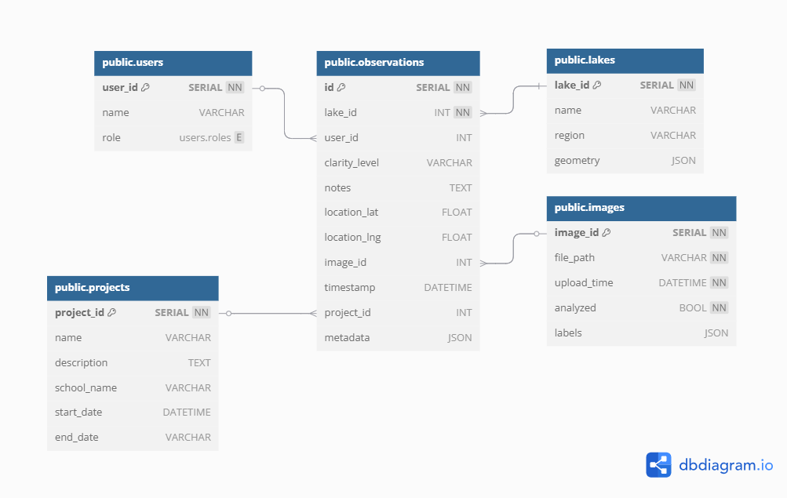

# 🗃️ Lake Observer Database Schema (Forward-Compatible)

This schema is designed to support flexibility and growth for the Lake Observer platform. It supports anonymous student data collection, teacher dashboards, public portals, and optional future ML/photo analysis.

---
## Diagram

## 📍 `observations` (Core table)

Stores individual shoreline observations.

| Field         | Type        | Description                                      |
|---------------|-------------|--------------------------------------------------|
| `id`          | Integer (PK) | Unique observation ID                           |
| `lake_id`     | FK → `lakes.id` | Which lake this observation is for          |
| `user_id`     | FK → `users.id` (nullable) | Who submitted it (optional)     |
| `clarity_level` | String     | Description or code of water clarity            |
| `notes`       | Text (nullable) | Optional extra info                           |
| `location_lat`| Float        | Latitude of observation                         |
| `location_lng`| Float        | Longitude of observation                        |
| `image_id`    | FK → `images.id` (nullable) | Attached image (if any)       |
| `timestamp`   | Datetime     | Time of submission                              |
| `project_id`  | FK → `projects.id` (nullable) | Associated campaign/class     |
| `metadata`    | JSON (nullable) | Flexible field for future needs             |

---

## 👤 `users` (Optional user accounts)

Stores info about teachers, admins, and optionally students.

| Field         | Type        | Description                                      |
|---------------|-------------|--------------------------------------------------|
| `id`          | Integer (PK) | Unique user ID                                  |
| `name`        | String       | Full name or display name                       |
| `role`        | Enum (admin, teacher, student) | Used for permissions         |
| `email`       | String (nullable) | Optional contact                              |
| `organization`| String (nullable) | School, NGO, etc.                            |

---

## 🌊 `lakes`

Stores lake metadata for filtering, grouping, and location context.

| Field         | Type        | Description                                      |
|---------------|-------------|--------------------------------------------------|
| `id`          | Integer (PK) | Unique lake ID                                  |
| `name`        | String       | Lake name                                       |
| `region`      | String       | Administrative region or watershed              |
| `geometry`    | JSON         | Polygon or point for mapping (GeoJSON-style)    |

---

## 🏫 `projects`

Optional grouping for campaigns, classrooms, or research efforts.

| Field         | Type        | Description                                      |
|---------------|-------------|--------------------------------------------------|
| `id`          | Integer (PK) | Unique project ID                               |
| `name`        | String       | Project name                                    |
| `description` | Text (nullable) | More context or goals of project           |
| `school_name` | String (nullable) | For education-linked projects             |
| `start_date`  | Date (nullable) | Optional project window start              |
| `end_date`    | Date (nullable) | Optional project window end                |

---

## 🖼️ `images`

Handles image uploads and processing metadata.

| Field         | Type        | Description                                      |
|---------------|-------------|--------------------------------------------------|
| `id`          | Integer (PK) | Unique image ID                                 |
| `file_path`   | String       | Path or URL to stored image                     |
| `upload_time` | Datetime     | When the image was uploaded                     |
| `analyzed`    | Boolean      | Whether image has been processed by ML          |
| `labels`      | JSON (nullable) | Detected features, scores, etc.            |

---

## 🔄 Relationships

- `observations.lake_id` → `lakes.id`
- `observations.user_id` → `users.id` *(optional)*
- `observations.image_id` → `images.id` *(optional)*
- `observations.project_id` → `projects.id` *(optional)*

---

## 🧩 Notes on Flexibility

- Observations can be **anonymous** (no `user_id`)
- ML integration is optional — just add `image_id` and later `labels`
- Projects allow teachers, researchers, or volunteers to group observations
- Future fields can go into the `metadata` column as a JSON blob

---

